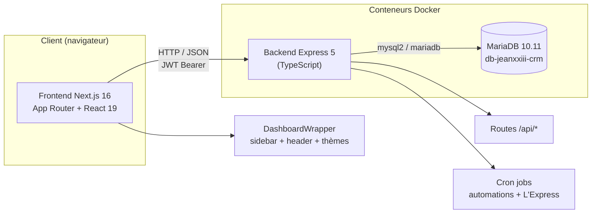
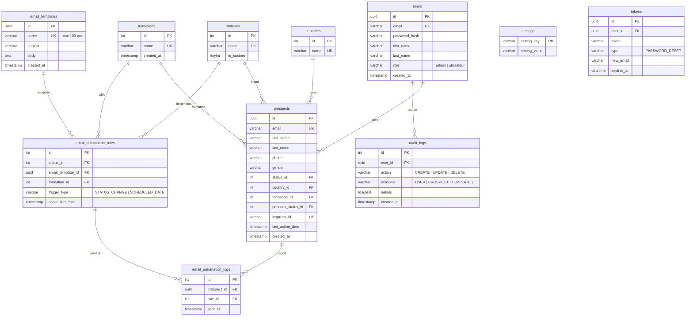
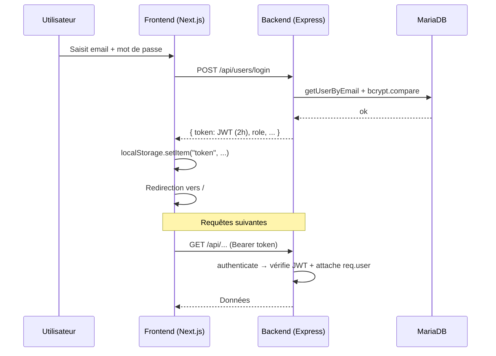
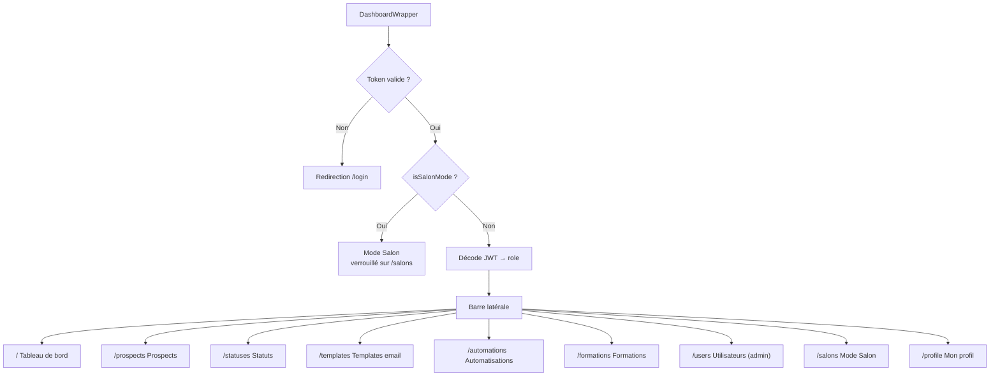
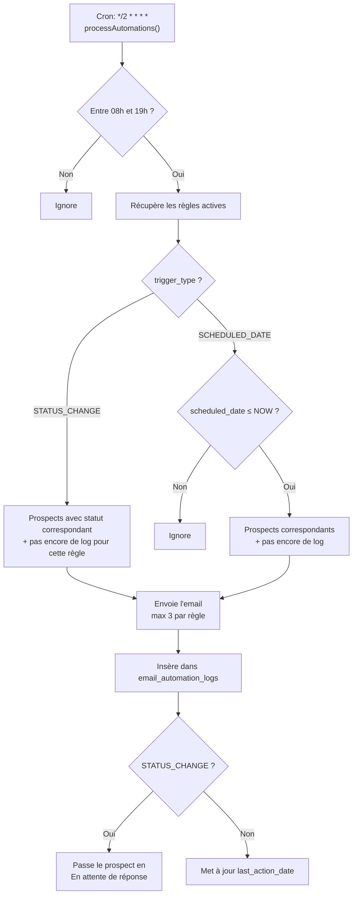
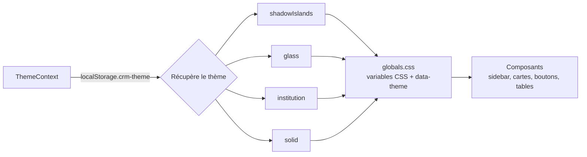
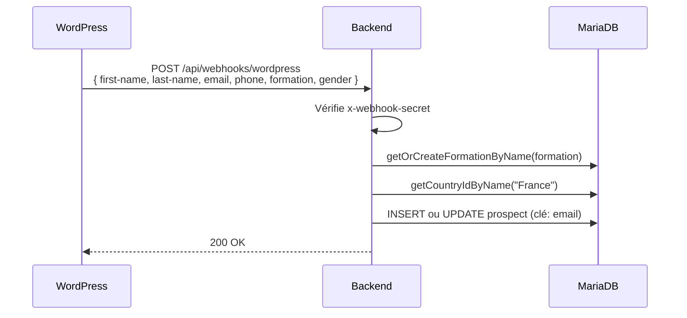
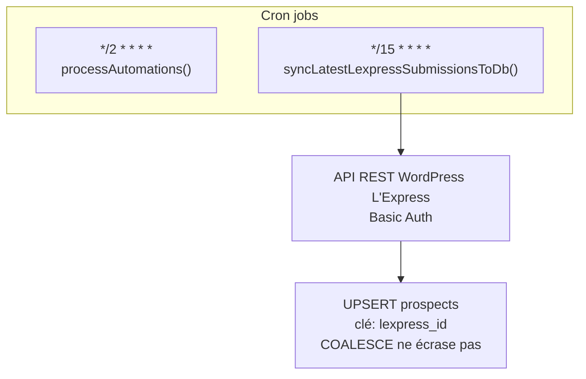

# Documentation technique — Jean XXIII CRM

Documentation de référence de l'application **Jean XXIII CRM** pour
l'Ensemble Scolaire Jean XXIII. Elle couvre l'architecture globale, le modèle
de données, l'authentification, la navigation, l'API backend, le système de
thèmes, les automatisations email et la synchronisation L'Express, avec des
diagrammes Mermaid pour illustrer les flux.

---

## Sommaire

1. [Architecture globale](#architecture-globale)
2. [Base de données](#base-de-données)
3. [Authentification](#authentification)
4. [Navigation et layout](#navigation-et-layout)
5. [API Backend](#api-backend)
6. [Emails — templates, automatisations et SMTP](#emails--templates-automatisations-et-smtp)
7. [Système de thèmes](#système-de-thèmes)
8. [Webhook WordPress et synchronisation L'Express](#webhook-wordpress-et-synchronisation-lexpress)
9. [Hooks frontend](#hooks-frontend)
10. [CI/CD et Dépendances](#cicd-et-dépendances)

---

## Architecture globale

L'application est composée de trois services conteneurisés avec Docker Compose,
orchestrés par `Makefile`. Le frontend Next.js consomme l'API Express via des
services TypeScript (couche `frontend/app/services/`).

- **Frontend** (`frontend/`) : Next.js 16 (App Router), React 19, Tailwind CSS v4.
  Toutes les pages sont enveloppées par `DashboardWrapper` (navigation, thèmes, toasts).
- **Backend** (`backend/`) : Express 5, exposé sur le port 5000, montée sur `/api/*`.
  Les fichiers statiques uploadés sont servis sur `/uploads`.
- **Base de données** : MariaDB 10.11. Le schéma est initialisé via `dump.sql`
  au premier démarrage d'un volume vide.
- **Orchestration** : `docker-compose.yml` (dev) et `docker-compose.prod.yml` (prod),
  pilotées par le `Makefile`.

### Variables d'environnement

| Variable | Rôle |
|---|---|
| `FRONTEND_PORT` | Port du frontend (dev) |
| `BACKEND_PORT` | Port du backend |
| `DB_PORT` | Port MariaDB exposé |
| `NEXT_PUBLIC_API_URL` | URL de l'API côté client |
| `MYSQL_ROOT_PASSWORD` | Mot de passe root MariaDB |
| `MYSQL_DATABASE` | Nom de la base de données |
| `MYSQL_USER` / `MYSQL_PASSWORD` | Identifiants MariaDB |
| `JWT_SECRET` | Secret pour la signature des JWT |
| `SMTP_HOST` / `SMTP_PORT` / `SMTP_USER` / `SMTP_PASS` | Configuration SMTP |
| `LEXPRESS_API_URL` / `LEXPRESS_USER` / `LEXPRESS_API_KEY` | API L'Express |
| `WEBHOOK_SECRET` | Secret pour le webhook WordPress |
| `FRONTEND_URL` | URL publique du frontend (liens dans les emails) |

### Commandes Makefile

| Commande | Action |
|---|---|
| `make dev-up` | Démarre l'environnement de développement |
| `make dev-down` | Arrête l'environnement de développement |
| `make dev-build` | Reconstruit les conteneurs dev |
| `make dev-logs` | Affiche les logs en temps réel |
| `make prod-up` | Démarre la production |
| `make prod-down` | Arrête la production |
| `make prod-build` | Reconstruit les conteneurs prod |
| `make prod-logs` | Affiche les logs prod |

---

## Base de données

### Modèle relationnel

### Tables et rôles

| Table | Rôle |
|---|---|
| `users` | Comptes utilisateurs, rôle `admin` ou `utilisateur` |
| `prospects` | Contacts / leads gérés par le CRM |
| `statuses` | Statuts des prospects (système ou personnalisés) |
| `countries` | Liste des pays |
| `formations` | Formations proposées (créées manuellement ou auto depuis webhook/L'Express) |
| `email_templates` | Templates d'email rédigés par les utilisateurs |
| `email_automation_rules` | Règles d'envoi automatique (par changement de statut ou date) |
| `email_automation_logs` | Journal des envois automatiques (dedup par prospect × règle) |
| `audit_logs` | Journal d'audit des actions CRUD |
| `settings` | Paramètres clé/valeur (ex: `password_reset_enabled`) |
| `tokens` | Tokens de réinitialisation de mot de passe (expiration 1h) |

---

## Authentification

Le flux est basé sur un **JWT** stocké côté client (`localStorage['token']`).
Le middleware `authenticate` décode le token ; le contrôle de rôle se fait
directement dans les routes via des conditions sur `req.user.role`.

- **Durée du token** : 2h (connexion) / 6h (ré-authentification pour mode Salon).
- **Déconnexion** : `localStorage.removeItem("token")` + redirection vers `/login`.
- **Session expirée** : le wrapper `api.ts` intercepte les 401, clear le token et redirige.
- **Réinitialisation mot de passe** : flux forgot-password → email avec token UUID (expiration 1h) → formulaire de reset.

### Rôles

| Rôle | Droits |
|---|---|
| `admin` | Accès complet : CRUD utilisateurs, audit logs, paramètres système, sync L'Express complète |
| `utilisateur` | CRUD prospects, templates, automatisations, statuts, formations ; envoi d'emails |

---

## Navigation et layout

La navigation est centralisée dans `frontend/app/components/DashboardWrapper.tsx`.
Le composant gère la barre latérale, le header et le mode Salon.

### Mode Salon

Le mode Salon est un formulaire de capture de leads destiné à être exposé lors de salons.
Quand activé :
- L'application se verrouille sur la route `/salons`
- La navigation est masquée
- Pour sortir, l'utilisateur doit ré-authentifier son mot de passe (`POST /api/users/reauthenticate`)
- Un overlay de succès s'affiche après chaque soumission

### Responsive

- **Desktop** (≥1600px) : barre latérale visible en permanence
- **Mobile** (<1600px) : menu hamburger avec panneau glissant depuis la gauche

---

## API Backend

Mittelware : `authenticate` (JWT) pour les routes protégées. Les routes
publiques n'exigent aucun token.

### Utilisateurs

| Méthode | Route | Accès | Description |
|---|---|---|---|
| `POST` | `/api/users/login` | public | Connexion, retourne le JWT |
| `POST` | `/api/users/forgot-password` | public | Demande de réinitialisation (gated par setting) |
| `POST` | `/api/users/reset-password` | public | Reset mot de passe avec token |
| `GET` | `/api/users` | admin | Liste des utilisateurs |
| `GET` | `/api/users/me` | authentifié | Profil de l'utilisateur connecté |
| `PUT` | `/api/users/me` | authentifié | Mise à jour de son profil |
| `POST` | `/api/users` | admin | Crée un utilisateur (+ email credentials) |
| `PUT` | `/api/users/:id` | admin | Met à jour un utilisateur |
| `DELETE` | `/api/users/:id` | admin | Supprime un utilisateur |
| `POST` | `/api/users/reauthenticate` | authentifié | Ré-authentification (mode Salon) |

### Prospects

| Méthode | Route | Accès | Description |
|---|---|---|---|
| `GET` | `/api/prospects` | authentifié | Liste des prospects (avec joints status/country) |
| `GET` | `/api/prospects/:id` | authentifié | Détail d'un prospect |
| `POST` | `/api/prospects` | authentifié | Crée un prospect |
| `PUT` | `/api/prospects/:id` | authentifié | Met à jour un prospect |
| `DELETE` | `/api/prospects/:id` | authentifié | Supprime un prospect |
| `POST` | `/api/prospects/:id/send-email` | authentifié | Envoie un email avec un template |

### Statuts

| Méthode | Route | Accès | Description |
|---|---|---|---|
| `GET` | `/api/statuses` | authentifié | Liste des statuts |
| `GET` | `/api/statuses/:id` | authentifié | Détail d'un statut |
| `POST` | `/api/statuses` | authentifié | Crée un statut |
| `PUT` | `/api/statuses/:id` | authentifié | Modifie un statut (admin requis pour les statuts système) |
| `DELETE` | `/api/statuses/:id` | authentifié | Supprime un statut (personnalisé uniquement) |

### Templates email

| Méthode | Route | Accès | Description |
|---|---|---|---|
| `GET` | `/api/email-templates` | authentifié | Liste des templates |
| `GET` | `/api/email-templates/:id` | authentifié | Détail d'un template |
| `POST` | `/api/email-templates` | authentifié | Crée un template (nom ≤100 car., unique) |
| `PUT` | `/api/email-templates/:id` | authentifié | Modifie un template |
| `DELETE` | `/api/email-templates/:id` | authentifié | Supprime un template (si pas utilisé en automatisation) |

### Automatisations

| Méthode | Route | Accès | Description |
|---|---|---|---|
| `GET` | `/api/automations` | authentifié | Liste des règles |
| `POST` | `/api/automations` | authentifié | Crée une règle |
| `PUT` | `/api/automations/:id` | authentifié | Modifie une règle |
| `DELETE` | `/api/automations/:id` | authentifié | Supprime une règle |

### Formations

| Méthode | Route | Accès | Description |
|---|---|---|---|
| `GET` | `/api/formations` | public | Liste des formations |
| `POST` | `/api/formations` | authentifié | Crée une formation |
| `PUT` | `/api/formations/:id` | authentifié | Modifie une formation |
| `DELETE` | `/api/formations/:id` | authentifié | Supprime une formation (si pas référencée) |

### Pays

| Méthode | Route | Accès | Description |
|---|---|---|---|
| `GET` | `/api/countries` | public | Liste des pays |

### Paramètres

| Méthode | Route | Accès | Description |
|---|---|---|---|
| `GET` | `/api/settings/:key` | public | Lecture d'un paramètre |
| `PUT` | `/api/settings/:key` | admin | Modification d'un paramètre |

### Audit Logs

| Méthode | Route | Accès | Description |
|---|---|---|---|
| `GET` | `/api/audit-logs?page=&limit=` | admin | Journal paginé des actions |

### L'Express

| Méthode | Route | Accès | Description |
|---|---|---|---|
| `POST` | `/api/lexpress/sync-latest` | authentifié | Sync incrémentale (50 dernières submissions) |
| `POST` | `/api/lexpress/sync-full` | admin | Sync complète (paginée) |
| `GET` | `/api/lexpress/last-sync` | authentifié | Timestamp de la dernière sync incrémentale |

### Webhook

| Méthode | Route | Accès | Description |
|---|---|---|---|
| `POST` | `/api/webhooks/wordpress` | secret header | Réception des leads WordPress |

---

## Emails — templates, automatisations et SMTP

### Templates

Les templates sont stockés dans `email_templates` (nom, sujet, corps) et
gérés via l'interface `/templates` ou l'API.

Variables disponibles dans le sujet et le corps :

| Variable | Valeur |
|---|---|
| `{{civility}}` | "Monsieur" / "Madame" (déduit du `gender`) |
| `{{first_name}}` | Prénom du prospect |
| `{{last_name}}` | Nom du prospect |
| `{{email}}` | Email du prospect |
| `{{phone}}` | Téléphone du prospect |
| `{{formation}}` | Formation du prospect |
| `{{programme}}` | Alias de formation |

### Envoi manuel

`POST /api/prospects/:id/send-email` avec `{ template_id }` :
1. Charge le prospect et le template
2. Remplace les variables via `templateParser.ts`
3. Envoie via `nodemailer`
4. Met à jour `last_action_date`

### Envoi automatique (cron)

- Le cron s'exécute toutes les 2 minutes.
- Seulement entre 08h00 et 19h00.
- Max 3 emails par règle et par exécution.
- La table `email_automation_logs` assure la dedup (clé unique `prospect_id × rule_id`).
- Les règles `STATUS_CHANGE` basculent automatiquement le prospect vers le statut "En attente de réponse" après envoi.

### SMTP

Configuration via variables d'environnement :

| Variable | Rôle |
|---|---|
| `SMTP_HOST` | Serveur SMTP |
| `SMTP_PORT` | Port (465 = SSL, 587 = STARTTLS) |
| `SMTP_USER` | Compte émetteur |
| `SMTP_PASS` | Mot de passe |
| `FRONTEND_URL` | Lien dans le corps du mail |

Le template HTML des emails reprend la charte graphique : carte blanche 600 px,
bandeau supérieur orange `#e84e1b`, police Inter, et signature en pied de page
(`` depuis `backend/public/signature.png`).

---

## Système de thèmes

Quatre thèmes sont définis dans `frontend/app/contexts/ThemeContext.tsx` et
appliqués via des variables CSS (`globals.css`). Le choix est persisté dans
`localStorage['crm-theme']` et appliqué via l'attribut `data-theme` sur `<html>`.

| Thème | Style |
|---|---|
| `shadowIslands` | Verre sombre, arrondi généreux, accent orange |
| `glass` | Verre translucide, accent cyan |
| `institution` (défaut) | Palette bleu nuit institutionnelle, arrondi modéré |
| `solid` | Solide, angles droits, sans flou |

Chaque thème expose un objet `t` (wrapper, sidebar, header, main, card,
tableHeader, tableRow, input, btnPrimary, btnGhost, textMuted, title,
activeNav, navHover) consommé par les composants via `useTheme()`.

### Variables CSS

| Variable | Rôle |
|---|---|
| `--bg-main` | Fond de l'application |
| `--bg-sidebar` | Fond de la barre latérale |
| `--bg-header` | Fond du header |
| `--bg-card` | Fond des cartes |
| `--bg-table-header` | Fond de l'en-tête de tableau |
| `--border-color` | Couleur des bordures |
| `--text-main` | Texte principal |
| `--text-muted` | Texte atténué |
| `--accent` | Couleur d'accent (`#e84e1b` — orange Jean XXIII) |
| `--input-bg` | Fond des champs de saisie |
| `--radius-box` | Rayon de bordure |

---

## Webhook WordPress et synchronisation L'Express

### Webhook WordPress

`POST /api/webhooks/wordpress` — sécurisé par header `x-webhook-secret`.

- Crée ou met à jour un prospect (upsert par email).
- Country par défaut : France (id 1).
- Status par défaut : premier statut de la liste.
- Formation créée automatiquement si elle n'existe pas.

### Synchronisation L'Express

- **Incrémentale** (cron toutes les 15 min) : récupère les 50 dernières submissions.
- **Complète** (admin only) : fetch paginé de toutes les submissions.
- Upsert par `lexpress_id` avec `ON DUPLICATE KEY UPDATE` + `COALESCE`
  (ne écrase pas les champs non-null existants).

---

## Hooks frontend

| Hook | Fichier | Rôle |
|---|---|---|
| `useAuth` | `hooks/useAuth.ts` | Login + stockage token + redirection ; ré-authentification Salon |
| `useCrud<T, P>` | `hooks/useCrud.ts` | CRUD générique : chargement, création, édition, suppression avec undo optimiste |
| `usePagination` | `hooks/usePagination.ts` | Gestion de pagination (page, totalPages, next, prev) |
| `useProfile` | `hooks/useProfile.ts` | Chargement profil, validation email/mot de passe, mise à jour |
| `useSearch<T>` | `hooks/useSearch.ts` | Recherche filtrée sur une liste |
| `useSort` | `hooks/useSort.ts` | Tri asc/desc par champ |

### Tri des données (DataTable)

Les pages Prospects, Templates email et Automatisations supportent le tri par
en-tête de colonne via le composant `SortHeader` :

- Le parent initialise `useSort(field, direction)` et trie lui-même les données
  avant de les passer à `DataTable` (le composant n'effectue pas le tri).
- Les colonnes triables déclarent `sortable: true` avec un champ `field` correspondant.
- 1er clic : tri ascendant (▲) ; 2e clic : descendant (▼).

| Page | Colonnes triables |
|---|---|
| Prospects | Nom, Contact, Formation, Pays, Statut, Dernière action |
| Templates email | Template & Sujet, Contenu |
| Automatisations | Déclencheur (Statut / Date), Formation Cible |

### Système de toasts

`ToastContext` expose `showToast(message, type, duration, onUndo?)` :
- Types : `success`, `error`, `undo`, `info`
- Le type `undo` affiche un bouton "Annuler" liant à l'action d'annulation de `useCrud`
- Auto-dismiss avec barre de progression animée
- Rendu via `createPortal` en position fixe (bas-droite)

---

## CI/CD et Dépendances

### GitHub Actions

- **`deploy.yml`** : sur push vers `main`, exécute sur runner self-hosted :
  `git pull` → `docker compose -f docker-compose.prod.yml down` → `build --no-cache` → `up -d` → prune images
- **`auto-pr.yml`** : sur push vers une branche non-main, crée automatiquement une PR vers `main`

### Dependabot

- `npm` : weekly pour `/backend` et `/frontend` (groupé, max 3 PRs)
- `github-actions` : weekly (max 2 PRs)

### Stack technique

| Couche | Technologie | Version |
|---|---|---|
| Frontend | Next.js (App Router) | 16.3.2 |
| UI | React | 19.2.8 |
| Style | Tailwind CSS | v4 |
| Langage frontend | TypeScript | ^7.0.2 |
| Backend | Express | ^5.2.1 |
| Langage backend | TypeScript | ^6.0.3 |
| Base de données | MariaDB | 10.11 |
| ORM/Driver | mysql2 / mariadb | ^3.22.5 / ^3.5.3 |
| Auth | jsonwebtoken | ^9.0.3 |
| Hash mot de passe | bcryptjs | ^3.0.3 |
| Email | nodemailer | ^9.0.3 |
| Conteneurs | Docker + Docker Compose | — |
| CI/CD | GitHub Actions + self-hosted runner | — |
| Reverse proxy prod | Nginx + Certbot (Let's Encrypt) | — |
| Tunnel prod | Cloudflare Zero Trust | — |
